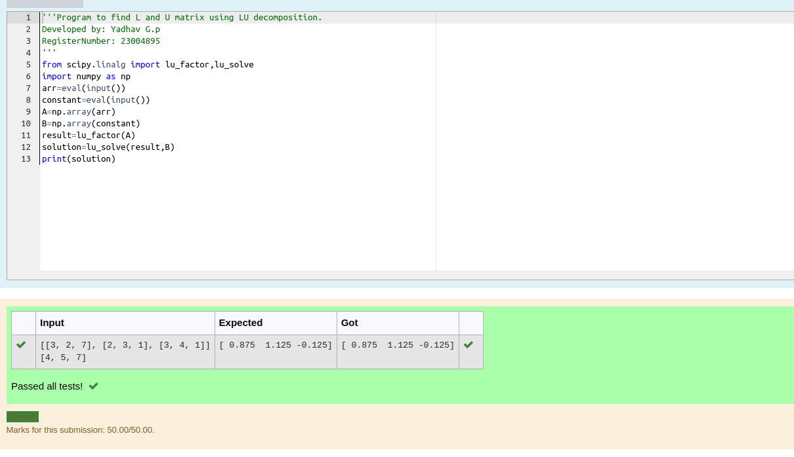

# LU Decomposition 

## AIM:
To write a program to find the LU Decomposition of a matrix.

## Equipments Required:
1. Hardware – PCs
2. Anaconda – Python 3.7 Installation / Moodle-Code Runner

## Algorithm
1. Import the numpy module to use the built_in function for calculation
2. Prepare the lists from each linear equations and assign in np.array() 
3. Using the np.linalg.solve(),we can find the solutions
4. End of the program

## Program:
(i) To find the L and U matrix
```
/*
Program to find the L and U matrix.
Developed by:Yadhav G.P
RegisterNumber: 23004895
*/
from scipy.linalg import lu
import numpy as np
arr=eval(input())
A=np.array(arr)
P,L,U=lu(A)
print(L)
print(U)
``````
(ii) To find the LU Decomposition of a matrix
```
/*
Program to find the LU Decomposition of a matrix.
Developed by: Yadhav G.P
RegisterNumber: 23004895
*/
from scipy.linalg import lu_factor,lu_solve
import numpy as np
arr=eval(input())
constant=eval(input())
A=np.array(arr)
B=np.array(constant)
result=lu_factor(A)
solution=lu_solve(result,B)
print(solution)
``````
## Output:

1.
2.
## Result:
Thus the program to find the LU Decomposition of a matrix is written and verified using python programming.

